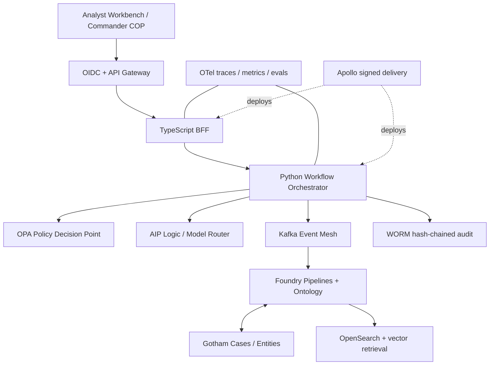

# ClearGlassInc Artemis — Production Intelligence Architecture

## System Architecture

ClearGlassInc Artemis is a coalition-aware intelligence control plane, not an autonomous
command authority. Gotham supplies investigations, link analysis, entity tracking, and the
operational picture. Foundry integrates batch and streaming sources and exposes governed
Ontology objects/actions. AIP hosts model-backed functions, copilots, agents, prompt versions,
and evaluations. Apollo promotes signed releases across classified, disconnected, and edge
environments with health-gated rollback.



The web application exposes an Analyst Workbench (timeline, graph, map, evidence viewer),
Commander Common Operating Picture, approval inbox, model/eval dashboard, and governance
console. Every response includes classification markings, provenance, model/prompt version,
confidence, and a stable evidence citation. WebSocket/SSE updates carry only policy-filtered
object deltas; the browser never receives a superset for client-side filtering.

The TypeScript gateway terminates identity, validates schemas and idempotency keys, and passes
a signed actor/context envelope to Python services. Durable Temporal workflows coordinate
triage, enrichment, correlation, recommendation, human approval, execution, and compensation.
Kafka topics are partitioned by tenant and mission, use schema-registry compatibility checks,
and route poison messages to a quarantined DLQ.

### Reliability and latency budgets

| Path | SLO | Design |
|---|---:|---|
| live ingest to triage | p95 750 ms | regional Kafka, warm consumers |
| ontology read | p95 300 ms | materialized views, bounded graph traversal |
| recommendation | p95 2.5 s | parallel tools, tiered model routing |
| policy decision | p99 30 ms | local signed policy bundle, deny on timeout |
| operational approval | human-bound | durable task, expiry and re-authentication |

## Data and Ontology

Foundry Ontology is the governed semantic/action layer shared by applications and agents.
Core object types are `IntelEvent`, `Observation`, `Entity`, `Person`, `Organization`, `Asset`,
`Location`, `Identity`, `Indicator`, `Source`, `Mission`, `Case`, `Hypothesis`, `Alert`,
`Recommendation`, `ActionPackage`, `Approval`, `Feedback`, `Outcome`, `ModelRun`,
`ArtifactVersion`, and `PolicyDecision`.

Key links include `OBSERVES`, `ATTRIBUTED_TO`, `LOCATED_AT`, `ASSOCIATED_WITH`, `SUPPORTS`,
`CONTRADICTS`, `PART_OF_MISSION`, `DERIVED_FROM`, `PRODUCED_BY`, `RECOMMENDS`, `APPROVES`, and
`SUPERSEDES`. A relationship is a first-class temporal assertion:

```yaml
RelationshipAssertion:
  keys: [assertion_id]
  properties:
    subject_id: string
    predicate: string
    object_id: string
    valid_from: timestamp
    valid_to: timestamp?
    observed_at: timestamp
    confidence: float # calibrated, never a substitute for provenance
    source_ids: [string]
    derivation_run_id: string?
    classification: string
    compartments: [string]
    releasability: [string]
```

Bi-temporal state separates when a claim was true from when Artemis learned it. Raw evidence
is immutable; corrections create superseding assertions. Every derived object retains dataset
RID/transaction, transform version, source record IDs, model/prompt/tool versions, policy
decision, and operator edits. Confidence is decomposed into source reliability, information
credibility, corroboration, and model calibration.

Ontology Actions (`OpenCase`, `AttachEvidence`, `SubmitRecommendation`, `ApproveAction`,
`RecordOutcome`) are the only mutation surface. Their server-side functions re-evaluate ABAC;
agents and humans therefore share the same business invariants. Object sets are filtered by
tenant, mission, clearance, compartment, purpose, nationality/releasability, and time-bound
need-to-know grants before retrieval or model context construction.

## AI and Agent Design

The analyst copilot searches authorized evidence, explains links, drafts hypotheses, and
creates cited intelligence products. The commander copilot summarizes mission posture and
competing courses of action, but cannot issue an operational instruction. Specialized agents
form a bounded graph:

1. **Triage** normalizes, deduplicates, classifies, and assigns urgency.
2. **Enrichment** invokes allow-listed Foundry/Gotham/search tools in parallel.
3. **Correlation** proposes temporal/entity links and records contrary evidence.
4. **Red-team/verification** challenges attribution, checks citations, and calibrates confidence.
5. **Product** creates a marked, source-cited intelligence draft.
6. **Recommendation** prepares alternatives, assumptions, risk, and an action package.
7. **Approval broker** pauses the workflow for appropriately cleared human approvers.

The model router uses classification, task, latency budget, context size, language, cost ceiling,
and data-sovereignty zone. It selects only models approved for that zone. Retrieval is hybrid
BM25/vector plus ontology traversal; retrieved chunks retain ACL labels and are rechecked at
tool time. Prompt injection defenses treat retrieved text as untrusted data, delimit it from
instructions, prohibit dynamic tool names, validate typed outputs, and require a policy permit
for every tool call.

Actions are categorized: read-only enrichment may run automatically; reversible administrative
actions require one human; operationally significant or cross-boundary actions require two-person
approval; prohibited actions are unavailable as tools. Approval tokens bind actor, proposal hash,
scope, expiry, policy version, and exact parameters, preventing approval reuse after mutation.

## Self-Improvement Loop

Artemis learns task policy, never its mission or authorization boundary:

`capture -> curate -> evaluate -> propose -> review -> shadow -> canary -> promote/rollback`.

Capture includes explicit ratings, field-level corrections, accept/reject reasons, query reformulation,
alert disposition, tool failures, latency, override, downstream case outcome, and mission result.
Telemetry is minimized and purpose-bound; absence of a click is not silently treated as a negative
label. Curators resolve label ambiguity and freeze versioned, time-split evaluation sets.

Nightly jobs stratify failures by mission, language, source, classification, model, and operator
cohort. AIP evaluations measure groundedness/citation validity, precision, recall, false-positive
rate, calibration error, policy violations, unsafe-tool rate, latency, cost, operator trust, and
mission-specific outcome proxies. Candidate generators may propose prompt text, few-shot examples,
graph steps, thresholds, retrieval weights, or routing rules. They cannot edit policy, approval
requirements, mission objectives, audit behavior, or their own evaluation gates.

Each proposal contains immutable before/after artifacts, diff, rationale, training/eval lineage,
slice results, security tests, cost/latency impact, owner, expiry, rollback artifact, and signature.
Two authorized reviewers approve material changes with separation of duties. Shadow traffic runs
without actions; then a 1%/5%/25% canary compares against a concurrent control. Apollo promotes a
signed digest only when all health and eval gates pass. Page-Hinkley/PSI distribution drift,
calibration degradation, elevated reject/override rates, policy violations, or SLO regression halt
promotion and restore the pinned prior digest. No production interaction updates weights online.

## Full-Stack Implementation

```text
apps/web-ui                 Next.js, React, map/graph, SSE, approval re-auth
apps/api-node               Fastify BFF, OIDC, schema validation, idempotency
apps/ai-python              FastAPI, Temporal workers, agent/eval/model router
services/policy-engine      OPA bundles and decision logs
services/audit-ledger       WORM sink, hash chain, transparency checkpoints
data/ontology               Foundry object/link/action contracts
data/sql                    workflow metadata, feedback, artifact registry
infra                       Kafka, OTel, secrets, signed containers
```

Representative API contract:

```python
@router.post("/v1/cases/{case_id}/recommendations")
async def recommend(case_id: UUID, actor: Actor = Depends(authenticated_actor)):
    permit = await pdp.require(actor, "recommendation.create", resource={"case": str(case_id)})
    handle = await temporal.start_workflow(
        "triage_to_recommendation",
        {"case_id": str(case_id), "actor_context": actor.signed_context},
        id=f"recommend:{case_id}:{permit.decision_id}",
    )
    return {"workflow_id": handle.id, "status": "accepted"}
```

Ontology-driven, parameterized retrieval:

```python
async def authorized_context(client, actor, event_id: str):
    object_set = client.ontology.objects.IntelEvent.where(
        lambda e: (e.event_id == event_id)
        & e.compartments.all_in(actor.compartments)
        & e.releasability.intersects(actor.coalition_scope)
    )
    event = await object_set.fetch_one()
    links = await event.entities.where(lambda x: x.confidence >= 0.65).take(50)
    return Context(event=event, entities=links)  # serializers preserve markings
```

Durable workflow gate:

```python
@workflow.defn
class ActionPackageWorkflow:
    approved = False

    @workflow.signal
    def approve(self, token: SignedApprovalToken) -> None:
        verify_bound_token(token, expected_hash=self.package.digest)
        self.approved = True

    @workflow.run
    async def run(self, package: ActionPackage):
        self.package = package
        await workflow.execute_activity(record_proposal, package)
        await workflow.wait_condition(lambda: self.approved, timeout=timedelta(hours=4))
        await workflow.execute_activity(recheck_policy_and_execute, package)
```

All services emit OpenTelemetry traces with `mission_id`, pseudonymous actor ID, workflow ID,
model/prompt/tool versions, policy decision ID, and evidence lineage—never raw classified content
in metric labels. Dashboards cover ingest lag, workflow state, tool/model SLOs, denied actions,
eval slices, drift, approval latency, rollback state, cost, and data freshness.

## Security and Governance

Identity uses federated OIDC/SAML, phishing-resistant MFA, device posture, short-lived workload
identity, mTLS, and continuous session risk. Authorization combines RBAC with ABAC and relationship
constraints. Field masking and entity-level ACLs apply inside Foundry; separate encryption domains,
namespaces, queues, indexes, caches, and keys prevent cross-coalition leakage. Cross-domain release
uses an explicit sanitization/review workflow, never direct replication.

OPA bundles are signed, versioned, tested against allow/deny fixtures, and fail closed. Secrets
come from HSM-backed vaults. Egress is allow-listed; agent code runs in resource-limited sandboxes
with no ambient credentials. Software releases carry SBOM, provenance attestations, image signatures,
vulnerability results, and Apollo promotion policy. Immutable audit events are hash chained, anchored
to periodic signed checkpoints, retained under records policy, and queryable by authorized auditors.

Threat modeling covers prompt injection, tool confused-deputy attacks, poisoned feedback, model
exfiltration, membership inference, ontology inference, approval-token replay, insider misuse, and
supply-chain compromise. Kill switches operate per agent, tool, model, tenant, mission, and region.

## Code Examples

The executable Python reference implementation is in `artemis/improvement.py`. It implements
versioned artifact references, quantitative evaluation gates, two-person separation of duties,
canary state, automatic rollback, and a hash-chained audit envelope. The orchestration reference
in `artemis/agents/orchestrator.py` demonstrates policy checks before reads and an explicit
human-approval result instead of action execution.

## Scenario Walkthrough

At 03:14Z, an edge sensor publishes a signed anomalous-navigation event. The ingest pipeline
verifies the source, preserves raw bytes, assigns event/mission/coalition labels, and writes a
Foundry `IntelEvent`; Kafka emits only its object RID. The triage worker deduplicates it against
the last hour and gives it 0.89 urgency. Enrichment retrieves permitted vessel, ownership, weather,
and prior-event objects. Correlation proposes two links, while the verification agent rejects a
third because its timestamp conflicts with radar evidence.

The recommendation agent drafts three cited alternatives and an `ActionPackage` to open a high
priority Gotham case and notify the watch commander. Opening the case is reversible but operationally
significant in this mission, so the workflow pauses. The commander sees evidence, counterevidence,
confidence decomposition, policy decision, and exact action diff. She rejects the notification as
too broad, narrows its coalition recipients, and approves the case. Mutation invalidates the old
token; policy rechecks the edited package and a new scoped approval token is issued before execution.

The correction, reason code, package diff, case outcome, and later confirmed identity become linked
`Feedback`/`Outcome` objects—not direct training data. A nightly slice shows broad-recipient proposals
have elevated rejection. A candidate workflow adds a recipient-minimization step. Offline replay
improves precision from 0.86 to 0.91 with no policy violations; reviewers inspect its diff and approve.
It runs in shadow, then a 5% canary. If recipient error, trust, latency, and policy gates remain healthy,
Apollo promotes the signed workflow digest. If any gate regresses, Artemis restores the pinned prior
digest. The agent improved how it drafts notifications; humans retained the mission, policy, approval,
and deployment authority throughout.
