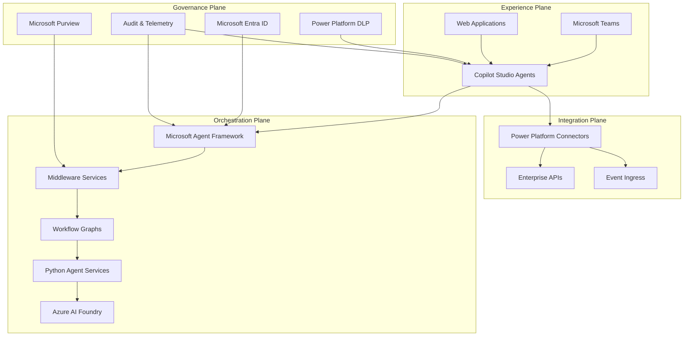
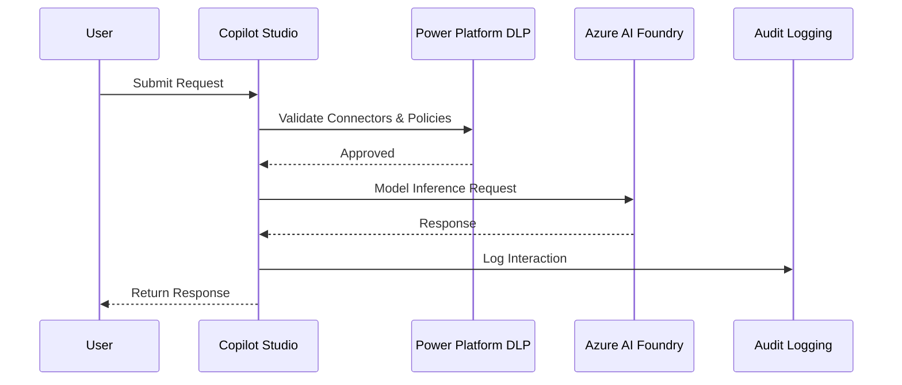
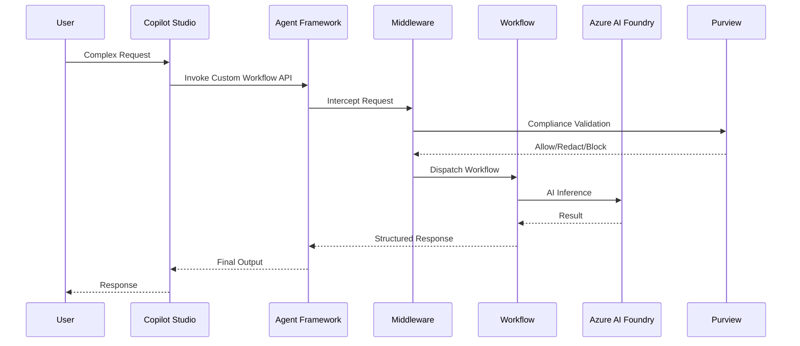
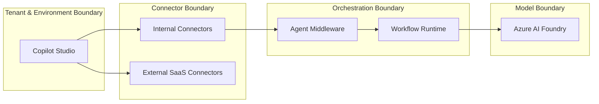

# ClearGlass AgentOps Platform

## Solution Architecture Document (SAD)

**Version:** 1.0  
**Status:** Publication-ready baseline  
**Platform Category:** Governed Operational AI Infrastructure  
**Primary Stack:** Microsoft Copilot Studio, Azure AI Foundry, Microsoft Agent Framework, Microsoft Purview, Microsoft Entra ID, Power Platform DLP

---

## 1. Executive Summary

The ClearGlass AgentOps Platform is a governed hybrid AI orchestration platform designed to enable enterprise-grade agent automation across regulated industries including financial services, healthcare, cybersecurity, and government operations. The platform combines the low-code agility of Microsoft Copilot Studio with the enterprise model governance capabilities of Azure AI Foundry and the programmable orchestration runtime of Microsoft Agent Framework.

The architectural objective is to separate conversational experience design from orchestration complexity while preserving enterprise governance, traceability, compliance, and operational control. Business users and makers can rapidly build governed conversational agents through Copilot Studio, while engineering teams extend platform functionality using Python- and .NET-based workflows, middleware, tools, and orchestrated multi-agent systems within Microsoft Agent Framework.

The platform enforces runtime governance through Microsoft Purview, Power Platform Data Loss Prevention (DLP), Entra ID, audit logging, policy enforcement middleware, and model boundary controls before sensitive data leaves approved enterprise zones. This architecture establishes a scalable and auditable AI operating model capable of supporting enterprise automation, human-in-the-loop workflows, policy-controlled model routing, and regulated investigative processes.

Strategically, ClearGlass positions itself not as a generic AI tooling provider, but as an enterprise-grade operational AI platform enabling organizations to deploy compliant, observable, revenue-producing AI workflows with measurable governance and operational accountability.

---

## 2. Assumptions and Constraints

### Assumptions

| ID | Assumption |
|---|---|
| A1 | Microsoft Copilot Studio will serve as the primary low-code interaction layer. |
| A2 | Azure AI Foundry is the approved enterprise model hosting and inference environment. |
| A3 | Microsoft Agent Framework will orchestrate advanced workflows and middleware pipelines. |
| A4 | Enterprise identity management will use Microsoft Entra ID exclusively. |
| A5 | Power Platform DLP policies will be enforced across all production environments. |
| A6 | All regulated workflows require auditable prompt, tool, and workflow logging. |
| A7 | Agent middleware will enforce redaction, classification, and telemetry tagging. |
| A8 | Production deployments will use containerized infrastructure. |
| A9 | Multi-environment separation between Dev, Test, and Prod is mandatory. |
| A10 | Human-in-the-loop escalation is required for high-risk workflows. |

### Constraints

| ID | Constraint |
|---|---|
| C1 | External non-Microsoft AI systems require explicit approval. |
| C2 | Data residency and geographic compliance must be preserved. |
| C3 | Connector usage is limited by Power Platform DLP classifications. |
| C4 | Direct end-user access to model endpoints is prohibited. |
| C5 | Sensitive workloads require inline compliance enforcement. |
| C6 | Stateless orchestration services are required for horizontal scaling. |
| C7 | Middleware interception cannot materially impact latency SLAs. |
| C8 | Production model changes require governance approval workflows. |

---

## 3. Non-Functional Requirements

| Category | Requirement |
|---|---|
| Scalability | Horizontal scaling through containerized orchestration services on AKS or Azure Container Apps. |
| Availability | 99.9% service uptime target for orchestration and interaction layers. |
| Security | Entra ID authentication, managed identities, RBAC, Purview DLP enforcement. |
| Compliance | Full auditability of prompts, workflows, tool calls, policy decisions, and outputs. |
| Observability | Centralized telemetry via Azure Monitor, Application Insights, and distributed tracing. |
| Performance | Standard request-response latency target under 3 seconds for low-complexity flows. |
| Resilience | Circuit breakers, retries, checkpointing, fallback workflows, and human escalation paths. |
| Maintainability | Modular orchestration services with version-controlled workflows and middleware. |
| Portability | Containerized runtime portability across Azure compute planes. |
| Cost Governance | Model routing optimization based on workload classification and token economics. |

---

## 4. Reference Architecture

The platform is organized into four operational planes:

1. Experience Plane
2. Integration Plane
3. Orchestration Plane
4. Governance Plane

The three foundational technology layers are:

- Copilot Studio
- Azure AI Foundry
- Microsoft Agent Framework

---

## 5. Core Components

### Copilot Studio

**Purpose:** Low-code conversational experience and business automation layer.

| Capability | Description |
|---|---|
| Topic Design | Conversational flows and intent routing |
| Prompt Actions | Model-backed conversational actions |
| Connector Governance | DLP-controlled connector access |
| User Channels | Teams, Web, Power Platform integration |
| Maker Experience | Low-code workflow authoring |

**Key Controls**

- Real-time DLP enforcement
- Environment segmentation
- Connector classification
- Managed publishing workflows

### Azure AI Foundry

**Purpose:** Enterprise AI model execution and management layer.

| Capability | Description |
|---|---|
| Model Hosting | Enterprise AI model endpoints |
| Model Routing | Controlled model execution |
| AI Services | Summarization, reasoning, embeddings |
| Observability | Centralized AI telemetry |
| Governance | Approved enterprise inference boundary |

Foundry serves as the approved AI execution zone for all enterprise-grade inferencing.

### Microsoft Agent Framework

**Purpose:** Programmable orchestration, workflow, middleware, and runtime control layer.

| Capability | Description |
|---|---|
| Workflow Graphs | Multi-step orchestrated workflows |
| Middleware | Request interception and governance |
| State Management | Durable workflow/session state |
| Multi-Agent Coordination | Coordinated agent systems |
| Python/.NET Runtime | Code-first extensibility |

**Middleware Functions**

- PII redaction
- Policy enforcement
- Request classification
- Telemetry tagging
- Rate limiting
- Identity propagation

### Governance Services

| Service | Purpose |
|---|---|
| Microsoft Purview | Runtime DLP and compliance |
| Entra ID | Authentication and RBAC |
| Power Platform DLP | Connector policy enforcement |
| Audit Logging | End-to-end traceability |
| Azure Monitor | Operational telemetry |

---

## 6. Data Flow and Sequence Diagrams

### Standard Low-Code Request Path

### Hybrid Workflow Handoff Path

---

## 7. Security Boundaries and Compliance Model

The platform enforces four major security boundaries:

1. Tenant and Environment Boundary
2. Connector Boundary
3. Orchestration Boundary
4. Model Boundary

### Compliance Enforcement

| Layer | Enforcement |
|---|---|
| Copilot Studio | Connector DLP |
| Agent Middleware | Redaction and classification |
| Purview | Runtime prompt/response evaluation |
| Entra ID | Identity and RBAC |
| Audit Layer | Immutable trace logging |

---

## 8. Hybrid Orchestration Patterns

### Pattern 1 — Low-Code Front End / Code-First Backend

| Aspect | Details |
|---|---|
| Use Case | Enterprise conversational workflows |
| Strength | Separation of UX and orchestration |
| Weakness | Requires API lifecycle management |
| Best For | Regulated enterprise automation |

### Pattern 2 — Topic-to-Workflow Handoff

| Aspect | Details |
|---|---|
| Use Case | Multi-step governed workflows |
| Strength | Controlled escalation path |
| Weakness | Workflow complexity management |
| Best For | Financial approvals, investigations |

### Pattern 3 — Model Router Orchestration

| Aspect | Details |
|---|---|
| Use Case | Cost/risk optimized AI routing |
| Strength | Dynamic workload optimization |
| Weakness | Increased routing complexity |
| Best For | Multi-model enterprise environments |

### Pattern 4 — Human-in-the-Loop Escalation

| Aspect | Details |
|---|---|
| Use Case | High-risk regulated operations |
| Strength | Improved accountability |
| Weakness | Reduced automation efficiency |
| Best For | Legal, compliance, government workflows |

---

## 9. Deployment Topology and Operating Model

### Deployment Topology

| Layer | Technology |
|---|---|
| Front-End Experience | Copilot Studio |
| API Gateway | Azure API Management |
| Orchestration Runtime | AKS / Azure Container Apps |
| Workflow Runtime | Agent Framework Python Services |
| AI Execution | Azure AI Foundry |
| Monitoring | Azure Monitor and Application Insights |

### Reliability Features

- Retry policies
- Circuit breakers
- Failover routing
- Workflow checkpointing
- Human escalation

### Operating Roles

| Role | Responsibility |
|---|---|
| Makers | Low-code conversational experiences |
| Engineers | Orchestration and middleware |
| Governors | Compliance, DLP, identity, audit |

### KPI Framework

| KPI | Description |
|---|---|
| Policy Violations Blocked | Compliance effectiveness |
| Workflow Completion Time | Operational efficiency |
| Escalation Rate | Human intervention frequency |
| Audit Coverage | Traceability completeness |
| Model Latency | Performance |

---

## 10. Implementation Roadmap

| Month | Milestone | Deliverables | Owner | Success Metric |
|---|---|---|---|---|
| 1-2 | Governance Foundation | DLP, Entra, environment strategy | Governance Team | Zero uncontrolled connectors |
| 2-3 | Foundry Integration | Approved model endpoints | AI Platform Team | Successful secure inference |
| 3-4 | Agent Framework Runtime | Python orchestration services | Engineering | Workflow execution baseline |
| 4-5 | Middleware Deployment | Redaction, telemetry, policy checks | Platform Engineering | Inline governance operational |
| 5-6 | Hybrid Workflow Enablement | Copilot-to-workflow handoffs | Product Engineering | Controlled escalation operational |
| 6-8 | Observability Layer | Telemetry and audit pipeline | SRE Team | Full request traceability |
| 8-9 | Human-in-the-Loop Controls | Approval workflows | Compliance Engineering | Approval coverage metrics |
| 9-10 | Multi-Agent Expansion | Coordinated workflows | AI Engineering | Parallel orchestration operational |
| 10-11 | Enterprise Hardening | DR, failover, resiliency | Infrastructure | SLA validation |
| 11-12 | Production Rollout | Enterprise launch | Executive Steering Committee | Production adoption |

---

## 11. Risks and Mitigations

| Risk | Mitigation |
|---|---|
| Connector sprawl | Strict DLP grouping and approvals |
| Data leakage | Middleware redaction and Purview enforcement |
| Model hallucination | Human approval checkpoints |
| Latency spikes | Model routing and caching |
| Untraceable workflows | Centralized telemetry and audit logging |
| Shadow AI adoption | Centralized approved platform strategy |
| Compliance drift | Runtime policy enforcement |
| Vendor dependency | Modular orchestration architecture |

---

## 12. Recommended Architecture Expansion Areas

The baseline SAD is publication-ready. The following sections should be added in the next architecture revision to strengthen enterprise review readiness:

1. Zero-trust runtime identity and scoped tool authorization.
2. Agent memory and knowledge architecture.
3. Multi-agent governance, supervision, and bounded delegation.
4. AI FinOps and model-cost governance.
5. Regulatory mapping matrix for SOC 2, HIPAA, GDPR, PCI DSS, ISO 27001, and NIST AI RMF.
6. Disaster recovery topology and degraded-mode operating model.

---

## 13. Source List

1. Microsoft Agent Framework Overview
2. Azure AI Foundry
3. Copilot Studio DLP Policies
4. Microsoft 365 Copilot Data Protection Architecture
5. Agent Framework Middleware Class
6. Purview and Agent Framework Security Integration
7. Bring Your Own Model in Copilot Studio
8. Agent Framework Middleware Documentation

---

## 14. Glossary

| Term | Definition |
|---|---|
| Copilot Studio | Microsoft low-code conversational AI platform |
| Azure AI Foundry | Enterprise AI model hosting and orchestration platform |
| Agent Framework | Microsoft orchestration runtime for programmable AI workflows |
| DLP | Data Loss Prevention |
| Purview | Microsoft compliance and governance platform |
| Entra ID | Microsoft enterprise identity platform |
| Middleware | Interception layer for governance and telemetry |
| AKS | Azure Kubernetes Service |
| HITL | Human-in-the-loop |
| RBAC | Role-based access control |
