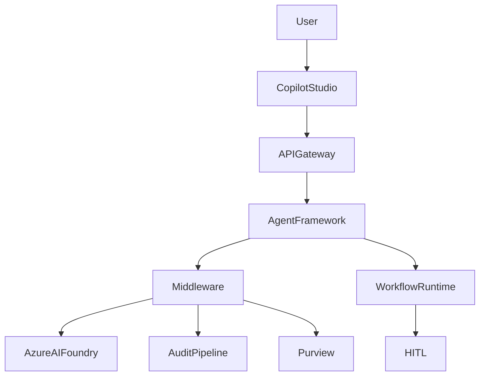
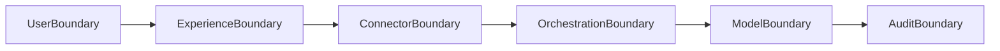
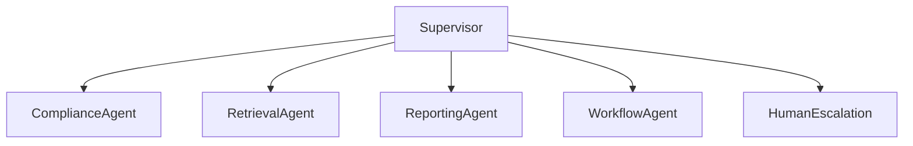

# ClearGlass Reference Architecture Diagram Pack

## Included Architecture Views

| Diagram | Purpose |
|---|---|
| Enterprise Runtime Architecture | Full operational platform |
| Trust Boundary Diagram | Governance and isolation |
| Workflow Handoff Sequence | Copilot-to-orchestration flow |
| AI Governance Plane | Compliance enforcement |
| Multi-Agent Supervision | Controlled autonomous execution |
| Disaster Recovery Topology | Cross-region resilience |

---

# Enterprise Runtime Architecture

---

# Trust Boundary Diagram

---

# Multi-Agent Supervision

---

# Strategic Objective

The diagram pack establishes:

- Enterprise architecture review readiness
- Governance visualization
- Security boundary clarity
- Operational AI positioning
- Technical investor communication assets
